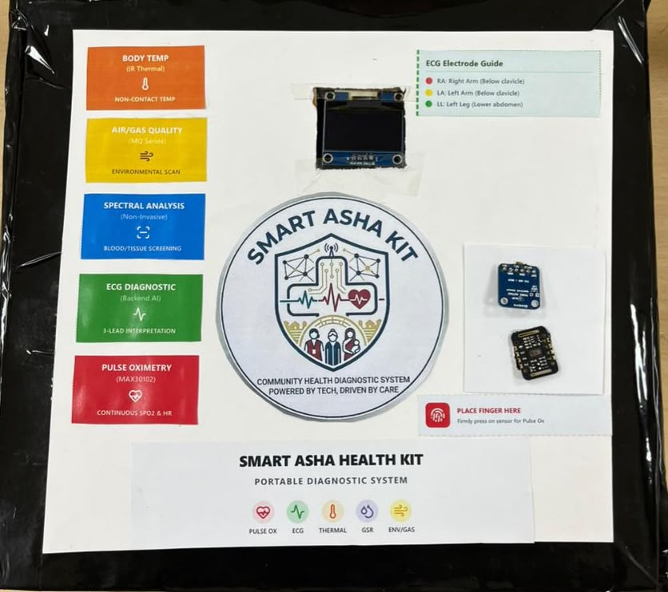

# Smart-ASHA

## Portable Edge-AI Healthcare Triage System for Rural Health Workers

Smart-ASHA is a portable Edge-AI healthcare triage system designed to assist rural health workers in low-resource environments. Using multimodal sensors and on-device intelligence, it enables real-time, non-invasive assessment of vital signs and health indicators without requiring internet connectivity.

---

## Problem Statement

Millions of people in rural and remote areas lack access to immediate healthcare diagnostics due to limited medical infrastructure, shortage of healthcare professionals, and poor internet connectivity.

ASHA workers often rely on manual observations and delayed referrals, which can slow down treatment for high-risk patients.

---

## Solution

Smart-ASHA leverages Edge AI and multimodal sensing to provide rapid health screening and triage support directly on-device.

The system operates fully offline and analyzes multiple physiological parameters simultaneously to identify potential health risks and assist ASHA workers in making faster and more informed decisions.

---

## Key Features

- Offline AI-powered healthcare assessment
- Fever detection using thermal sensing
- Blood oxygen (SpO₂) monitoring
- Respiratory condition assessment
- Stress level estimation
- Metabolic abnormality screening
- Real-time triage recommendations
- Portable and low-power design
- Designed specifically for rural healthcare environments

---

## Hardware Components

- ESP32-S3 Edge AI Controller
- MLX90640 Thermal Sensor
- MAX30102 Pulse Oximeter Sensor
- MPU6050 Motion Sensor
- GSR Sensor for Stress Detection
- MQ135 Gas Sensor for Breath Analysis
- OLED Display Module
- LED Triage Indicators
- Rechargeable Battery System

---

## Software Stack

- Python
- TensorFlow Lite
- Edge AI Inference
- Embedded C/C++
- Sensor Fusion Algorithms
- Real-time Signal Processing

---

## System Architecture

```text
Health Sensors
    ↓
ESP32-S3 Edge Controller
    ↓
Signal Processing & Sensor Fusion
    ↓
TensorFlow Lite Inference Engine
    ↓
Risk Classification Engine
    ↓
OLED Display + LED Indicators
    ↓
ASHA Worker Decision Support
```

---

## Repository Structure

```text
Smart-ASHA/
│
├── datasets/      # Training and testing datasets
├── docs/          # Architecture and technical documentation
├── firmware/      # Embedded firmware and sensor code
├── hardware/      # Sensor details and assembly guides
├── images/        # Prototype and architecture images
├── models/        # AI model information and metrics
├── notebooks/     # Experiments and model development
└── README.md
```

---

## Prototype Image

### Smart-ASHA Hardware Prototype



---

## Performance Metrics

| Metric | Value |
|--------|-------|
| Fever Detection Accuracy | 98.01% |
| Average Inference Time | 142 ms |
| Memory Usage | 232 KB |
| Connectivity Requirement | Offline |
| Deployment Target | Edge Device |

---

## Applications

- Rural Healthcare Centers
- Community Health Screening Camps
- Emergency Triage Support
- Remote Villages
- Mobile Healthcare Units
- Disaster Relief Operations

---

## Future Scope

- Multilingual voice assistance
- Telemedicine integration
- Cloud synchronization
- Predictive healthcare analytics
- Electronic health record integration
- Expansion to additional biomarkers

---

## Contributors

- Gauri Gupta
- Anmol Nandwani

---

## License

This project is developed for academic and research purposes.

---

## Vision

*"Affordable, intelligent, and accessible healthcare for every rural community."*
